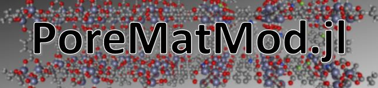

A pure-[Julia](https://julialang.org/) software package for manipulating chemical structures of porous crystals, built on [Xtals](https://github.com/SimonEnsemble/Xtals.jl) software to clean experimental data and provide novel hypothetical structural inputs to [PorousMaterials](https://github.com/SimonEnsemble/PorousMaterials.jl).  It is intended primarily for MOFs and other porous crystalline materials, but works with discrete molecular structures and simulated ensembles as well.
