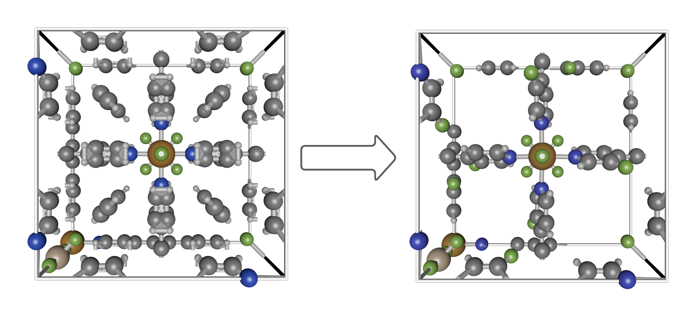

A pure-[Julia](https://julialang.org/) software package for manipulating chemical structures of porous crystals.  [PoreMatMod.jl](https://github.com/SimonEnsemble/PoreMatMod.jl) is built on the [@SimonEnsemble](https://SimonEnsemble.github.io) software [Xtals.jl](https://github.com/SimonEnsemble/Xtals.jl) to clean experimental and calculated data and provide novel hypothetical structural inputs to [PorousMaterials.jl](https://github.com/SimonEnsemble/PorousMaterials.jl) and other molecular dynamics or *ab initio* software packages.
It is intended primarily for MOFs and other porous crystalline materials, but can work with other periodic structures, ensembles, and discrete molecules as well.

`PoreMatMod.jl` can identify chemical substructures, create hypothetical structure libraries, and correct disorder in experimental data, using an implementation of Ullmann's algorithm for substructure isomorphism and the orthogonal Procrustes algorithm for point cloud alignment.  
Periodic cell boundaries are treated automatically, and the unit cell is preserved in transformations.

**Example**: repairing, activating, and functionalizing an experimental structure.
The structure below, of a MOF called [SIFSIX-2-Cu-i](https://dx.doi.org/10.1126/science.aaf2458), contains disordered PyC2 linkers and acetylene guest molecules.

Loading the data, resolving the disorder, removing the guest molecules, replacing the linkers, and saving the result can be done with a very short script:

```jldoctest; output=false
# Import the module
using PoreMatMod
# Load some messy data
xtal = Crystal("EMEHUB_C2H2.cif", remove_duplicates=true, check_overlap=false)
infer_bonds!(xtal, true)
# Repair the disordered linkers
repaired = replace(xtal, moiety("disordered_ligand!.xyz") => moiety("4-pyridyl.xyz"))
# Remove the guest molecules to produce the activated MOF
acetylene_search = substructure_search(moiety("acetylene.xyz"), repaired, disconnected_component=true)
activated = substructure_replace(acetylene_search, nothing, rand_all=true)
# Add a functional group
novel = replace(activated, moiety("3-H!-4-pyridyl.xyz") => moiety("3-F-4-pyridyl.xyz"))
# Save the result
write_cif(novel, "3,3'-F2-SIFSIX-2-Cu-i.cif")
# output
┌ Info: Crystal EMEHUB_C2H2.cif has I 4/m m m space group. I am converting it to P1 symmetry.
└         To prevent this, pass `convert_to_p1=false` to the `Crystal` constructor.
┌ Warning: carbon atom 1 in EMEHUB_C2H2.cif is bonded to more than four atoms!
└ @ Xtals ~/.julia/packages/Xtals/Kf4en/src/bonds.jl:407
┌ Warning: carbon atom 6 in disordered_ligand!.xyz is bonded to more than four atoms!
└ @ Xtals ~/.julia/packages/Xtals/Kf4en/src/bonds.jl:407
┌ Warning: carbon atom 1 in disordered_ligand!.xyz is bonded to more than four atoms!
└ @ Xtals ~/.julia/packages/Xtals/Kf4en/src/bonds.jl:407
```

Input files: [EMEHUB_C2H2.cif](assets/index/EMEHUB_C2H2.cif) [disordered_ligand!.xyz](assets/index/disordered_ligand!.xyz) [4-pyridyl.xyz](assets/index/4-pyridyl.xyz) [acetylene.xyz](assets/index/acetylene.xyz) [3-H!-4-pyridyl.xyz](assets/index/3-H!-4-pyridyl.xyz) [3-F-4-pyridyl.xyz](assets/index/3-F-4-pyridyl.xyz)


