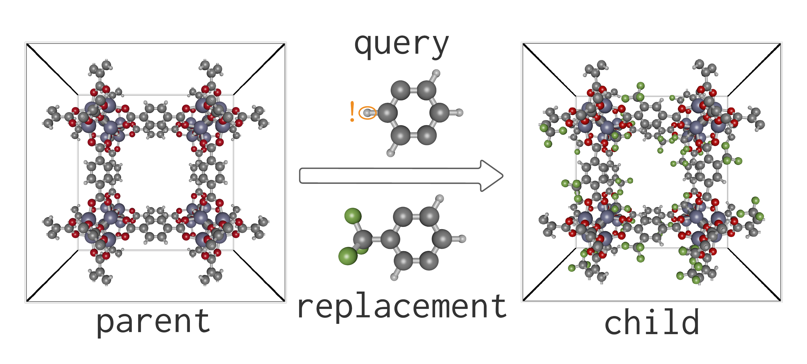

`PoreMatMod.jl` is a software package in [Julia](https://julialang.org/) for (i) subgraph matching and (ii) modifying crystal structures.

Functioning as a "find-and-replace" tool on atomistic crystal structure models of porous materials, `PoreMatMod.jl` can:

  - search crystals for chemical substructures
  - create libraries of hypothetical structures by e.g. decoration with functional groups
  - correct artifacts of X-ray structure determination (missing H, disorder, guests)
  - introduce defects into crystal structures

`PoreMatMod.jl` implements

 1. (for find operations) Ullmann's algorithm for subgraph isomorphism search
 2. (for replace operations) the orthogonal Procrustes algorithm for point cloud alignment.
    Periodic boundary conditions are respected, and the unit cell is preserved.

While developed primarily for porous crystals such as metal-organic frameworks (MOFs), `PoreMatMod.jl` can operate on any periodic atomistic system as well as discrete molecules.

### Introductory example: creating a functionalized MOF structure

Suppose we wish to decorate the linkers of IRMOF-1 with trifluoromethyl (tfm) groups.
The `PoreMatMod.jl` code below accomplishes this by (i) searching the parent IRMOF-1 structure for a phenylene query fragment and (ii) replacing each instance with a tfm-phenylene replacement fragment to give the child structure.

```julia
# read crystal structure of the parent MOF
parent_xtal = Crystal("IRMOF-1.cif")

# read query and replacement fragments
query_fragment = moiety("p-phenylene.xyz")  # masked atoms marked with !
replacement_fragment = moiety("tfm-p-phenylene.xyz")

# (1) search parent structure for query fragment
# (2) replace occurrences of query fragment with replacement fragments
#     (with randomly chosen orientations)
child_xtal = replace(parent_xtal, query_fragment => replacement_fragment)
```



!!! example "Further examples"
    
    See the [examples page](https://simonensemble.github.io/PoreMatMod.jl/examples/) for links to Pluto notebooks with `PoreMatMod.jl` code to accomplish various find-and-replace tasks.

!!! note "Please cite our paper!"
    
    If you found `PoreMatMod.jl` useful, please cite our paper:
    
    > A. Henle, N. Gantzler, P. Thallapally, X. Fern, C. Simon. `PoreMatMod.jl`: Julia package for _in silico_ post-synthetic modification of crystal structure models. [Journal of Chemical Information and Modeling](https://pubs.acs.org/doi/10.1021/acs.jcim.1c01219). (2022)
